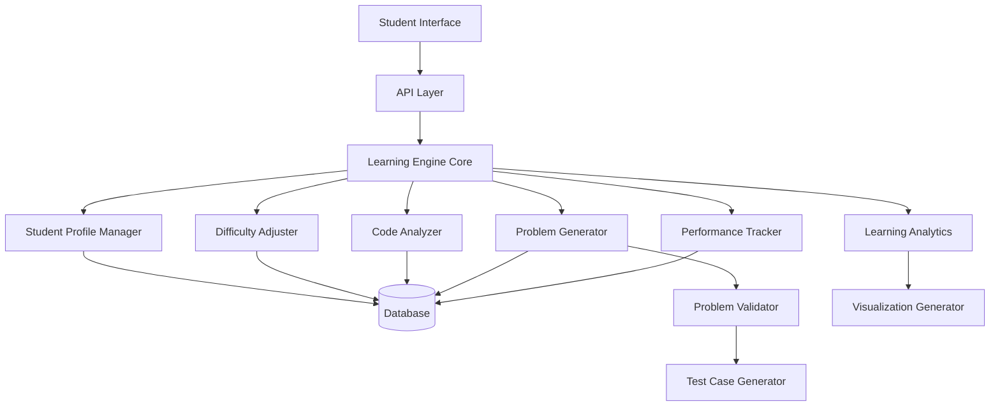

# Design Document: Personalized DSA Learning Engine

## Overview

The Personalized DSA Learning Engine is a sophisticated adaptive learning system built on Next.js with TypeScript that provides individualized data structures and algorithms practice. The system employs machine learning principles to understand each student's learning patterns, strengths, and weaknesses, then dynamically generates problems and adjusts difficulty to optimize learning outcomes.

The engine operates on a continuous feedback loop: it observes student performance, analyzes coding patterns, updates the student profile, and generates the next appropriate challenge. This creates a personalized learning experience that adapts in real-time to each student's progress.

## Architecture

The system follows a modular, event-driven architecture with clear separation of concerns:



### Core Components

**Learning Engine Core**: Orchestrates all components and manages the adaptive learning workflow. Acts as the central coordinator that processes student interactions and triggers appropriate responses from specialized components.

**Performance Tracker**: Monitors and analyzes student performance across different DSA topics. Calculates metrics like accuracy rates, solution times, and identifies learning patterns.

**Problem Generator**: Creates custom DSA problems based on student profiles and current learning objectives. Ensures problems are appropriately challenging and educationally valuable.

**Code Analyzer**: Examines student code submissions to identify coding patterns, style preferences, and algorithmic approaches. Builds a comprehensive understanding of how each student thinks and codes.

**Difficulty Adjuster**: Dynamically modifies problem constraints and complexity based on performance data. Ensures optimal challenge level for continued learning.

**Student Profile Manager**: Maintains comprehensive student profiles including learning history, preferences, strengths, weaknesses, and progress metrics.

## Components and Interfaces

### Learning Engine Core Interface

```typescript
interface LearningEngineCore {
  processStudentSubmission(studentId: string, problemId: string, solution: CodeSubmission): Promise<LearningResponse>
  generateNextProblem(studentId: string, topicPreference?: DSATopic): Promise<GeneratedProblem>
  getStudentAnalytics(studentId: string): Promise<StudentAnalytics>
  updateStudentProfile(studentId: string, updates: ProfileUpdate): Promise<void>
}

interface LearningResponse {
  feedback: string
  correctness: boolean
  performanceMetrics: PerformanceMetrics
  nextRecommendation: ProblemRecommendation
}
```

### Performance Tracker Interface

```typescript
interface PerformanceTracker {
  recordSubmission(studentId: string, submission: CodeSubmission, result: SubmissionResult): Promise<void>
  calculateTopicAccuracy(studentId: string, topic: DSATopic): Promise<number>
  identifyWeaknesses(studentId: string): Promise<DSATopic[]>
  getPerformanceTrends(studentId: string, timeRange: TimeRange): Promise<PerformanceTrend[]>
}

interface PerformanceMetrics {
  solutionTime: number
  accuracy: boolean
  codeQuality: number
  algorithmicEfficiency: number
  topic: DSATopic
}
```

### Problem Generator Interface

```typescript
interface ProblemGenerator {
  generateProblem(constraints: ProblemConstraints, studentProfile: StudentProfile): Promise<GeneratedProblem>
  validateProblem(problem: GeneratedProblem): Promise<ValidationResult>
  createTestCases(problem: GeneratedProblem): Promise<TestCase[]>
}

interface ProblemConstraints {
  topic: DSATopic
  difficultyLevel: number
  maxInputSize: number
  timeLimit: number
  memoryLimit: number
  preferredApproach?: AlgorithmicApproach
}

interface GeneratedProblem {
  id: string
  title: string
  description: string
  constraints: ProblemConstraints
  examples: Example[]
  testCases: TestCase[]
  expectedComplexity: ComplexityBounds
}
```

### Code Analyzer Interface

```typescript
interface CodeAnalyzer {
  analyzeCode(code: string, language: ProgrammingLanguage): Promise<CodeAnalysis>
  identifyPatterns(studentId: string, submissions: CodeSubmission[]): Promise<CodingPatterns>
  updateStyleProfile(studentId: string, analysis: CodeAnalysis): Promise<void>
}

interface CodeAnalysis {
  algorithmicApproach: AlgorithmicApproach
  codeStyle: CodingStyle
  dataStructuresUsed: DataStructure[]
  complexity: ComplexityAnalysis
  patterns: string[]
}

interface CodingPatterns {
  preferredApproach: AlgorithmicApproach
  commonDataStructures: DataStructure[]
  namingConventions: NamingStyle
  codeOrganization: OrganizationStyle
}
```

### Difficulty Adjuster Interface

```typescript
interface DifficultyAdjuster {
  adjustDifficulty(studentId: string, topic: DSATopic, performanceData: PerformanceData): Promise<DifficultyAdjustment>
  calculateOptimalDifficulty(studentProfile: StudentProfile, topic: DSATopic): Promise<number>
  gradualAdjustment(currentLevel: number, targetLevel: number): number
}

interface DifficultyAdjustment {
  previousLevel: number
  newLevel: number
  adjustmentReason: string
  constraintChanges: ConstraintChange[]
}
```

## Data Models

### Student Profile Model

```typescript
interface StudentProfile {
  id: string
  createdAt: Date
  lastActive: Date
  
  // Performance Data
  topicMastery: Map<DSATopic, MasteryLevel>
  overallAccuracy: number
  averageSolutionTime: Map<DSATopic, number>
  
  // Learning Patterns
  learningVelocity: number
  preferredDifficultyCurve: DifficultyProgression
  weakAreas: DSATopic[]
  strongAreas: DSATopic[]
  
  // Code Style Preferences
  codingPatterns: CodingPatterns
  preferredComplexity: ComplexityPreference
  
  // Adaptive Parameters
  currentDifficultyLevels: Map<DSATopic, number>
  adaptationRate: number
}

interface MasteryLevel {
  level: number // 0-100
  confidence: number // statistical confidence in the measurement
  lastUpdated: Date
  problemsSolved: number
}
```

### Problem Model

```typescript
interface Problem {
  id: string
  title: string
  description: string
  topic: DSATopic
  difficultyLevel: number
  
  constraints: ProblemConstraints
  examples: Example[]
  testCases: TestCase[]
  
  // Generation metadata
  generatedFor: string // student ID
  generationTimestamp: Date
  personalizations: Personalization[]
  
  // Validation data
  isValidated: boolean
  validationResults: ValidationResult
}

interface Personalization {
  type: PersonalizationType
  description: string
  basedOn: string // what student data influenced this
}
```

### Submission Model

```typescript
interface CodeSubmission {
  id: string
  studentId: string
  problemId: string
  code: string
  language: ProgrammingLanguage
  submittedAt: Date
  
  // Results
  isCorrect: boolean
  executionTime: number
  memoryUsed: number
  testCaseResults: TestCaseResult[]
  
  // Analysis
  codeAnalysis: CodeAnalysis
  performanceMetrics: PerformanceMetrics
}

interface TestCaseResult {
  testCaseId: string
  passed: boolean
  expectedOutput: any
  actualOutput: any
  executionTime: number
}
```

### Analytics Model

```typescript
interface StudentAnalytics {
  studentId: string
  generatedAt: Date
  
  // Performance Overview
  overallProgress: ProgressSummary
  topicBreakdown: Map<DSATopic, TopicAnalytics>
  
  // Trends
  performanceTrends: PerformanceTrend[]
  difficultyProgression: DifficultyTrend[]
  
  // Insights
  strengths: string[]
  improvementAreas: string[]
  recommendations: LearningRecommendation[]
}

interface TopicAnalytics {
  topic: DSATopic
  masteryLevel: number
  problemsSolved: number
  averageAccuracy: number
  averageSolutionTime: number
  difficultyRange: [number, number]
  lastPracticed: Date
}
```

## Correctness Properties

*A property is a characteristic or behavior that should hold true across all valid executions of a system—essentially, a formal statement about what the system should do. Properties serve as the bridge between human-readable specifications and machine-verifiable correctness guarantees.*

Based on the prework analysis and property reflection to eliminate redundancy, the following properties ensure the correctness of the Personalized DSA Learning Engine:

### Property 1: Performance Data Recording Completeness
*For any* student submission, recording the submission should capture solution time, correctness status, and algorithmic approach in the performance database
**Validates: Requirements 1.1**

### Property 2: Accuracy Calculation Correctness
*For any* student and DSA topic with recorded submissions, the calculated accuracy rate should equal the number of correct submissions divided by total submissions for that topic
**Validates: Requirements 1.2**

### Property 3: Data Persistence Consistency
*For any* system data update (performance metrics, profile changes), the data should be immediately persisted and retrievable from the database
**Validates: Requirements 1.4, 6.2**

### Property 4: Historical Data Preservation
*For any* performance data recorded, it should remain accessible for trend analysis regardless of subsequent updates
**Validates: Requirements 1.5**

### Property 5: Problem Generation Uniqueness and Appropriateness
*For any* student profile and skill level, generated problems should be unique and match the specified difficulty constraints
**Validates: Requirements 2.1**

### Property 6: Weakness-Based Problem Prioritization
*For any* student profile with identified weak DSA topics, the majority of generated problems should target those weak areas
**Validates: Requirements 2.2**

### Property 7: Problem Constraint Validity
*For any* generated problem, the constraints should be solvable within the specified time and memory limits
**Validates: Requirements 2.3**

### Property 8: Problem Validation Completeness
*For any* generated problem, validation should verify solution existence, constraint feasibility, and difficulty level accuracy
**Validates: Requirements 2.4, 7.1, 7.4**

### Property 9: Problem Generation Performance
*For any* problem generation request, a valid problem should be returned within 2 seconds
**Validates: Requirements 2.5**

### Property 10: Bidirectional Difficulty Adjustment
*For any* student performance pattern (consistent success or struggle), difficulty should adjust appropriately in the corresponding direction (increase for success, decrease for struggle)
**Validates: Requirements 3.1, 3.2**

### Property 11: Gradual Difficulty Progression
*For any* difficulty adjustment, the change should be within predefined bounds to ensure gradual progression without sudden jumps
**Validates: Requirements 3.3**

### Property 12: Topic-Specific Difficulty Independence
*For any* student, difficulty levels should be maintained independently for each DSA topic
**Validates: Requirements 3.4**

### Property 13: Difficulty Adjustment Transparency
*For any* difficulty change, the system should log the adjustment with clear reasoning
**Validates: Requirements 3.5**

### Property 14: Code Pattern Recognition Accuracy
*For any* code submission, the analyzer should correctly identify coding patterns, naming conventions, and algorithmic preferences
**Validates: Requirements 4.1**

### Property 15: Style-Based Problem Personalization
*For any* student with identified coding preferences, generated problems should align with their preferred style and approach
**Validates: Requirements 4.2**

### Property 16: Solution Approach Detection
*For any* code submission, the analyzer should correctly classify whether the solution uses iterative or recursive approaches
**Validates: Requirements 4.3**

### Property 17: Data Structure Usage Identification
*For any* student's code submissions, commonly used data structures should be accurately identified and tracked
**Validates: Requirements 4.4**

### Property 18: Profile Update Consistency
*For any* detected coding patterns, the student profile should be updated with the corresponding personalization data
**Validates: Requirements 4.5**

### Property 19: Weakness Identification Accuracy
*For any* student with consistent errors in a DSA topic, the system should correctly identify and mark it as a weakness
**Validates: Requirements 1.3, 5.1**

### Property 20: Targeted Practice Recommendations
*For any* identified weakness, the system should generate appropriate targeted practice recommendations
**Validates: Requirements 5.2**

### Property 21: Improvement Tracking Continuity
*For any* student practicing weak areas, improvement should be tracked and reflected in performance metrics over time
**Validates: Requirements 5.3**

### Property 22: Progress Feedback Accuracy
*For any* student with tracked improvement, progress feedback should accurately reflect the improvement in previously weak areas
**Validates: Requirements 5.4**

### Property 23: Profile Improvement Updates
*For any* overcome weakness, the student profile should be updated to reflect the improvement
**Validates: Requirements 5.5**

### Property 24: Profile Lifecycle Management
*For any* new student, a complete profile with default settings should be created, and for returning students, complete learning history should be loaded correctly
**Validates: Requirements 6.1, 6.3**

### Property 25: Profile Data Integrity
*For any* student profile operation, data integrity should be maintained across all concurrent operations
**Validates: Requirements 6.4**

### Property 26: Profile Access Performance
*For any* profile data access request, current information should be returned within 100ms
**Validates: Requirements 6.5**

### Property 27: Test Case Coverage Completeness
*For any* generated problem, test cases should provide comprehensive coverage including edge cases
**Validates: Requirements 7.2**

### Property 28: Problem Presentation Quality
*For any* presented problem, it should include clear problem statements and illustrative examples
**Validates: Requirements 7.3**

### Property 29: Problem Regeneration on Validation Failure
*For any* problem that fails validation, the system should regenerate until quality standards are met
**Validates: Requirements 7.5**

### Property 30: Comprehensive Analytics Generation
*For any* analytics request, the system should provide performance trends, accuracy rates, solution times, difficulty progression, and visual representations using the most recent data
**Validates: Requirements 8.1, 8.3, 8.4, 8.5**

### Property 31: Progress Analysis Completeness
*For any* progress report, the system should highlight both areas of improvement and remaining challenges
**Validates: Requirements 8.2**

## Error Handling

The system implements comprehensive error handling across all components:

### Performance Tracking Errors
- **Invalid Submission Data**: Validate all submission data before processing; reject malformed submissions with descriptive error messages
- **Database Connection Failures**: Implement retry logic with exponential backoff; maintain local cache for critical operations
- **Calculation Errors**: Validate input data ranges; handle division by zero and null data gracefully

### Problem Generation Errors
- **Generation Timeout**: Implement timeout mechanisms for problem generation; fallback to pre-validated problem templates
- **Validation Failures**: Retry generation with adjusted parameters; escalate to manual review after multiple failures
- **Constraint Conflicts**: Detect impossible constraint combinations; provide alternative constraint suggestions

### Code Analysis Errors
- **Parsing Failures**: Handle syntax errors gracefully; provide partial analysis when possible
- **Pattern Recognition Errors**: Use confidence thresholds; flag uncertain analyses for review
- **Language Support Gaps**: Gracefully degrade to basic analysis for unsupported language features

### Profile Management Errors
- **Concurrent Modification**: Implement optimistic locking; resolve conflicts using last-write-wins with user notification
- **Data Corruption**: Validate profile data integrity; maintain backup copies for recovery
- **Migration Errors**: Handle schema changes gracefully; provide rollback mechanisms

### System-Level Error Handling
- **Rate Limiting**: Implement per-user rate limits; provide clear feedback when limits are exceeded
- **Resource Exhaustion**: Monitor system resources; gracefully degrade service quality under load
- **External Service Failures**: Implement circuit breaker patterns; provide offline functionality where possible

## Testing Strategy

The testing strategy employs a dual approach combining unit testing and property-based testing to ensure comprehensive coverage and correctness validation.

### Unit Testing Approach

Unit tests focus on specific examples, edge cases, and error conditions:

**Component-Level Testing**:
- Test individual methods with known inputs and expected outputs
- Verify error handling for invalid inputs and edge cases
- Test integration points between components
- Validate database operations and data transformations

**Example Unit Tests**:
- Test performance calculation with specific submission data
- Verify problem generation with predefined student profiles
- Test code analysis with sample code snippets
- Validate difficulty adjustment with known performance patterns

### Property-Based Testing Approach

Property-based tests verify universal properties across all possible inputs using **fast-check** (JavaScript/TypeScript property-based testing library):

**Configuration Requirements**:
- Minimum 100 iterations per property test to ensure comprehensive input coverage
- Each property test must reference its corresponding design document property
- Tag format: **Feature: dsa-learning-engine, Property {number}: {property_text}**

**Property Test Categories**:

**Data Integrity Properties**:
- Test that all data operations maintain consistency
- Verify that persistence operations are atomic and durable
- Ensure that concurrent operations don't corrupt data

**Algorithmic Correctness Properties**:
- Test that accuracy calculations are mathematically correct across all input ranges
- Verify that difficulty adjustments follow logical rules for all performance patterns
- Ensure that problem generation produces valid problems for all constraint combinations

**Performance Properties**:
- Test that response times meet requirements across various load conditions
- Verify that system performance degrades gracefully under stress
- Ensure that resource usage remains within acceptable bounds

**Behavioral Properties**:
- Test that the system responds appropriately to all valid user interactions
- Verify that personalization adapts correctly to all coding style variations
- Ensure that learning recommendations are relevant for all student profiles

### Testing Integration

**Continuous Testing**:
- Unit tests run on every code change
- Property tests run on pull requests and nightly builds
- Integration tests validate end-to-end workflows

**Test Data Management**:
- Use factories to generate realistic test data
- Maintain separate test databases for isolation
- Implement data cleanup procedures for consistent test environments

**Coverage Requirements**:
- Minimum 90% code coverage for unit tests
- All correctness properties must have corresponding property tests
- Critical paths must have both unit and property test coverage

The combination of unit and property-based testing ensures that the system is both correct in specific scenarios and robust across the full range of possible inputs and conditions.